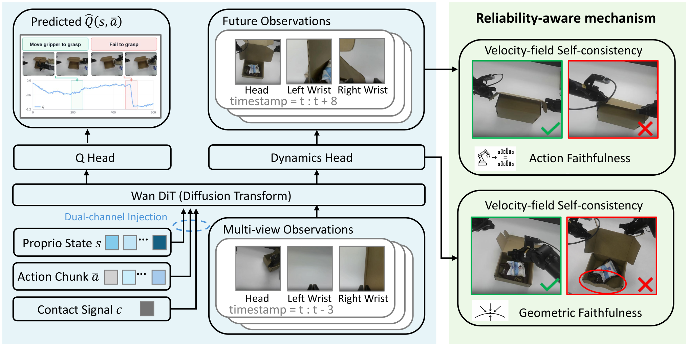

# REVAMP

### Reliability-Aware Dynamics-Value World Models for VLA Policy Improvement

  
  &nbsp;
  

<h3>
  👉 Visit the <a href="https://revampcorl.github.io/REVAMP/">full project page</a>
  for demo videos and per-task Q-value visualizations, 
  and the <a href="https://github.com/revampcorl/revamp_codebase">code repository</a> to run REVAMP.
</h3>

<video src="https://github.com/user-attachments/assets/0465a98f-ff59-4848-867f-b76355b00399" controls muted width="100%"></video>

## TL;DR

**REVAMP** improves a pretrained vision-language-action (VLA) policy beyond supervised
fine-tuning by pairing a learned video world model with a two-signal **reliability gate**.
Unreliable states trigger targeted real-environment rollouts that correct the world model
exactly where it was wrong, so the next round of imagined improvement can explore further
without entering a hallucination region. REVAMP improves the pretrained policy by
**15–17** success-rate points in simulation and **25–28** on the real robot, outperforming
both DSRL and a VLAW-style baseline on every task under an equal real-interaction budget.

## Highlights

- **Unified world model** — a single Wan2.2-based DiT backbone, conditioned on the action
  chunk and a contact signal, with two heads sharing one encoder: a dynamics head that
  predicts future multi-view frames and a Q-head that predicts action-and-contact-conditioned
  Q-values.
- **Reliability-aware mechanism** — every prediction is scored by two signals: an intrinsic
  velocity-field self-consistency residual (*geometric faithfulness*) and an external
  visual-probe-plus-inverse-dynamics check (*action faithfulness*).
- **Closed-loop improvement** — a frequent imagination loop fine-tunes the policy with
  reliability-gated Adjoint Matching (QAM), while a sparse real-interaction loop triggers
  targeted real rollouts at flagged states and refits the world model where it was unreliable.

## Results

| Setting | Task | Success-rate gain over π₀ |
| :-- | :-- | :--: |
| **Simulation** | TurnOnSinkFaucet | **+16.0** |
| | OpenCabinet | **+15.4** |
| | PickPlaceCounterToStove | **+17.0** |
| **Real robot** | Open Jar / Stack Box / Fold Cloth | **+25 to +28** |

Gains in percentage points over the SFT-pretrained π₀ policy.

## Tasks

- **Simulation (RoboCasa):** TurnOnSinkFaucet, OpenCabinet, PickPlaceCounterToStove
- **Real robot:** Open Jar, Stack Box, Fold Cloth

## Links

- 🌐 **Project page:** https://revampcorl.github.io/REVAMP/
- 💻 **Code:** https://github.com/revampcorl/revamp_codebase

---

This repository hosts the REVAMP project page (served at the project-page link above).
